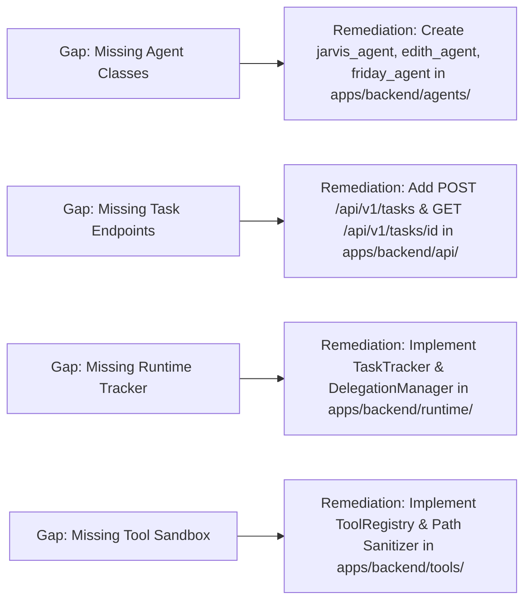

# EDITH-001 — Architecture Gap Analysis & Remediation Report

**Author:** Mannan Shah (System Designer & Solutions Architect)  
**Project:** EDITH (Enhanced Distributed Intelligent Task Handler)  
**Date:** August 30, 2026 (Updated: September 20, 2026)  
**Status:** APPROVED ARCHITECTURE BASELINE  

---

## 1. Executive Summary

This document presents the updated **Architecture Gap Analysis & Remediation Report** for EDITH. It reflects the current progress from EDITH-000 baseline publication, assesses implementation readiness across backend (`apps/backend`) and frontend (`apps/frontend`), and details the architectural remediation plan.

---

## 2. Updated Repository State Assessment

| Subsystem | Baseline State (Sprint 0) | Current Repository Implementation State | Gap Status |
| :--- | :--- | :--- | :--- |
| **Monorepo Layout** | Shell directories | Fully structured monorepo (`apps/backend`, `apps/frontend`, `docs/architecture`). | `RESOLVED` |
| **Core Specification** | Missing | Published `docs/EDITH_SYSTEM_ARCHITECTURE.md` baseline (EDITH-000). | `RESOLVED` |
| **System Architecture** | Initial draft | Complete 3-Agent blueprint (`JARVIS`, `EDITH`, `FRIDAY`) with Shared Runtime. | `RESOLVED` |
| **Backend API Gateway** | Empty placeholder | FastAPI application initialized (`apps/backend/app/main.py`) with `/` and `/health`. | `PARTIAL` — Task endpoints pending feature PR. |
| **Frontend Dashboard** | Empty placeholder | Next.js 15 application initialized (`apps/frontend/app/page.tsx`). | `PARTIAL` — Backend API client pending feature PR. |
| **Agent Infrastructure** | Non-existent | Baseline runtime docstring added; agent contracts defined in `docs/architecture/agent-architecture.md`. | `PARTIAL` — Agent classes pending feature PR. |
| **Tool Execution Layer** | Non-existent | Tool architecture & safety boundary specified in `docs/architecture/tool-architecture.md`. | `IN_PROGRESS` |
| **Voice Integration** | Non-existent | Web Speech API adapter interface specified in `docs/architecture/voice-architecture.md`. | `IN_PROGRESS` |
| **Slack Integration** | Non-existent | Event-driven incoming webhook adapter specified in `docs/architecture/slack-architecture.md`. | `IN_PROGRESS` |

---

## 3. Architecture Gap & Remediation Matrix

---

## 4. Key Remediation Milestones for Team Members

1. **For Prem (Backend Lead):** Merge `prem/edith-001-vertical-slice` feature branch into `main` to provide active task endpoints (`POST /api/v1/tasks`, `GET /api/v1/tasks/{id}`) and runtime task tracking.
2. **For Deev (Frontend Lead):** Merge `feature/deev/frontend` feature branch to provide Next.js task submission inputs and short polling dashboard controls.
3. **For Mannan (Architecture Lead):** Maintain strict architectural compliance across all PRs, ensuring agents decide delegation, runtime coordinates transport, and host tools remain sandboxed.
