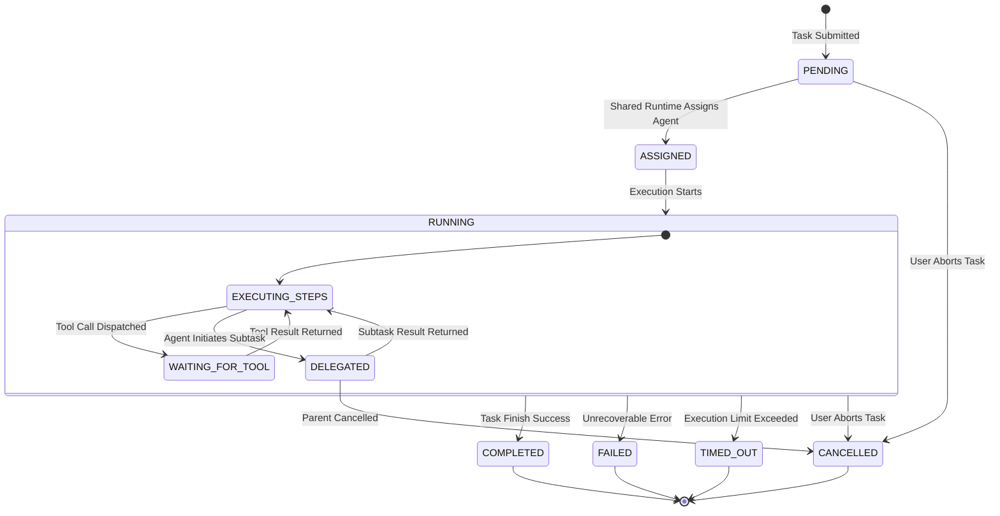
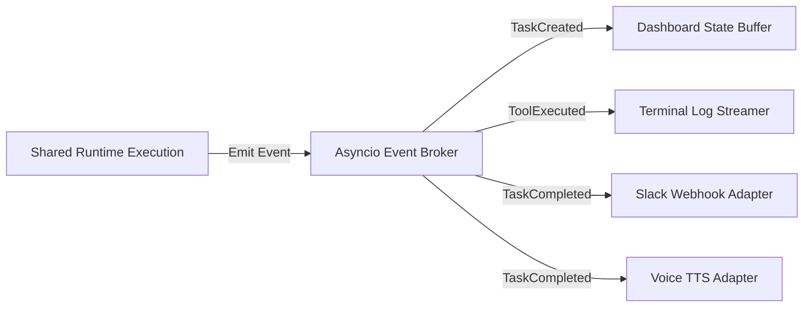

# EDITH-001 — Communication & Task Lifecycle Architecture

**Author:** Mannan Shah (System Designer & Solutions Architect)  
**Project:** EDITH (Enhanced Distributed Intelligent Task Handler)  
**Date:** August 30, 2026 (Updated: September 20, 2026)  
**Status:** APPROVED ARCHITECTURE BASELINE  

---

## 1. Task Lifecycle & State Transitions

Tasks are the primary unit of work in EDITH. Each task progresses through a deterministic, auditable state machine maintained by the **Shared Runtime**.



### State Descriptions

| Task State | Description | Transition Trigger |
| :--- | :--- | :--- |
| `PENDING` | Initial state when a task request is accepted by FastAPI. | API receives POST `/api/v1/tasks`. |
| `ASSIGNED` | Task is assigned to a target agent (default: JARVIS). | Shared Runtime registers task. |
| `RUNNING` | Agent actively executes reasoning steps or tool actions. | Agent execution loop begins. |
| `WAITING_FOR_TOOL` | Task is suspended awaiting controlled tool completion. | Tool request dispatched to Tool Registry. |
| `DELEGATED` | Agent has delegated a subtask to EDITH or FRIDAY. | Source agent emits delegation request. |
| `COMPLETED` | Task finished successfully with output result. | Agent emits final output. |
| `FAILED` | Execution failed due to unhandled error or invalid action. | Exception caught by runtime. |
| `TIMED_OUT` | Execution exceeded maximum allocated time limit. | Watchdog timer expires. |
| `CANCELLED` | Execution was explicitly aborted by the user. | API receives DELETE `/api/v1/tasks/{id}`. |

---

## 2. Architecture Task Schemas & Contracts

> **Note:** The schemas below define the authoritative architecture baseline for task objects, delegation payloads, and execution results.

### 2.1 Core Task Schema

```json
{
  "task_id": "tsk_9876543210",
  "parent_task_id": null,
  "source_agent": "USER",
  "target_agent": "JARVIS",
  "status": "RUNNING",
  "prompt": "Create a python script to search files and summarize them.",
  "context": {
    "workspace_root": "c:\\Users\\Mannan\\OneDrive\\Desktop\\Edith",
    "environment": "development"
  },
  "created_at": "2026-09-20T18:00:00Z",
  "updated_at": "2026-09-20T18:00:05Z",
  "steps": [],
  "result": null,
  "error": null
}
```

### 2.2 Subtask Delegation Schema

```json
{
  "task_id": "sub_1234567890",
  "parent_task_id": "tsk_9876543210",
  "source_agent": "JARVIS",
  "target_agent": "FRIDAY",
  "status": "DELEGATED",
  "prompt": "Scan directory docs/ and organize markdown files by topic.",
  "delegation_metadata": {
    "delegation_reason": "File organization specialty required",
    "delegation_depth": 1,
    "timeout_seconds": 60
  },
  "created_at": "2026-09-20T18:00:03Z"
}
```

---

## 3. In-Process Domain Event System

To ensure **Zero-Budget Compliance**, EDITH uses a lightweight, in-memory `asyncio` event broker. Events are emitted by the Shared Runtime and consumed asynchronously by logging, UI polling buffers, Voice adapters, and Slack webhooks.



### Core Domain Events

| Event Name | Producer | Payload Data | Consumers |
| :--- | :--- | :--- | :--- |
| `TaskCreatedEvent` | FastAPI / Shared Runtime | `task_id`, `source_agent`, `target_agent`, `prompt` | Dashboard UI |
| `TaskDelegatedEvent` | Shared Runtime | `parent_task_id`, `child_task_id`, `source_agent`, `target_agent` | Dashboard UI, Logging |
| `ToolExecutionStartedEvent` | Tool Registry | `task_id`, `tool_name`, `arguments` | Terminal Log Buffer |
| `ToolExecutionCompletedEvent` | Tool Registry | `task_id`, `tool_name`, `status`, `exit_code` | Terminal Log Buffer |
| `TaskCompletedEvent` | Shared Runtime | `task_id`, `result`, `duration_ms` | Dashboard, Voice TTS, Slack |
| `TaskFailedEvent` | Shared Runtime | `task_id`, `error_code`, `error_message` | Dashboard, Slack Webhook |
