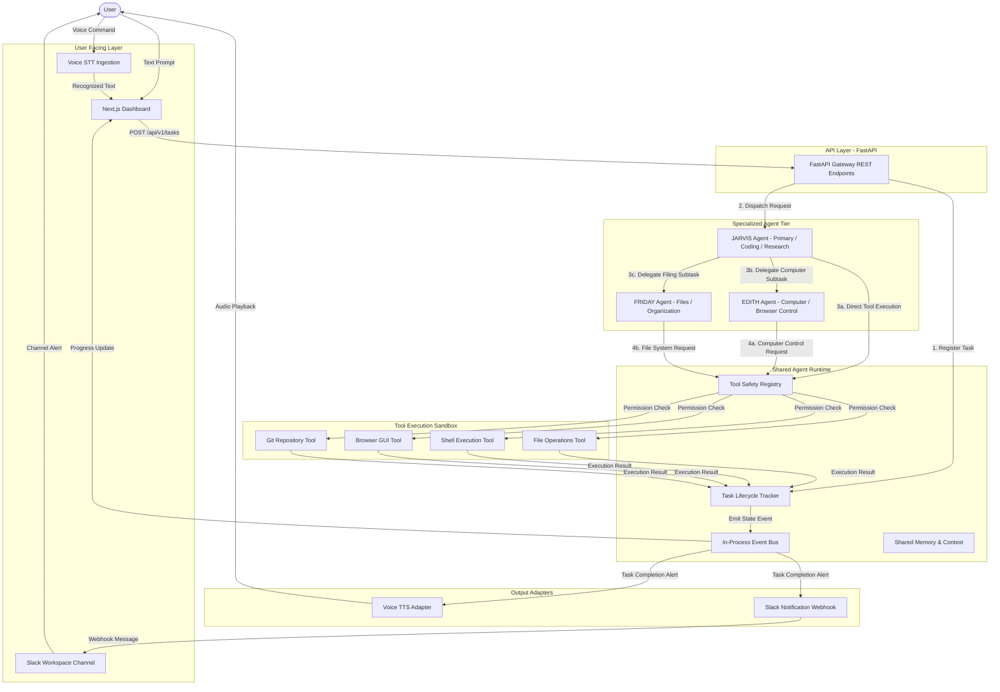

# Architecture Diagram 01 — Overall System Architecture

### Key Elements
- **User Interface:** Web Dashboard and browser Web Speech STT.
- **JARVIS:** Primary conversational entry point and decision-maker for agent delegation.
- **EDITH & FRIDAY:** Domain specialists delegated to by JARVIS.
- **Shared Runtime:** Coordinates transport, task state, events, memory, and permissions.
- **Tool Sandbox:** Enforces path boundaries and command execution safety.
