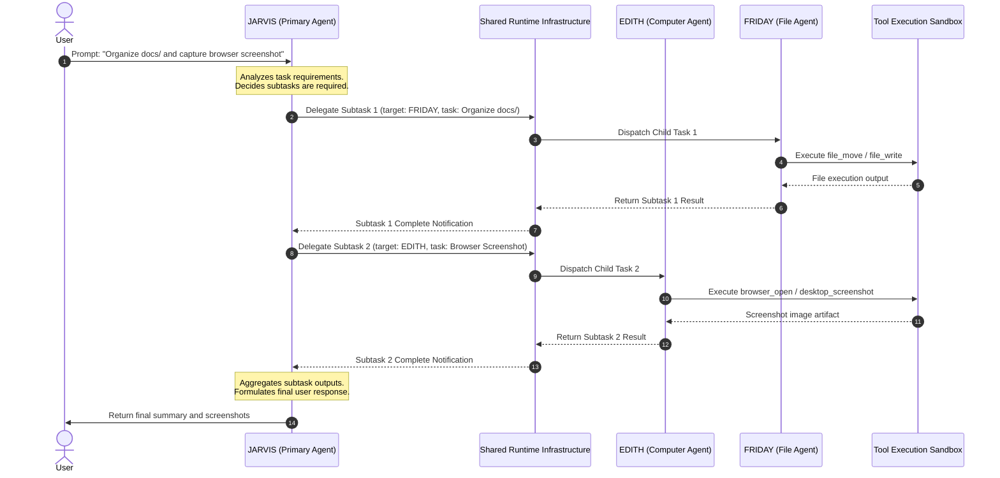

# Architecture Diagram 02 — Agent Communication & Delegation Flow

### Delegation Rules
1. **Agent Autonomy:** JARVIS inspects task complexity and delegates specific domain subtasks.
2. **Runtime Transport:** The Shared Runtime routes subtasks, generates child task IDs, and tracks progress.
3. **Execution Sandboxing:** Subtask actions execute through guarded Tool Sandbox endpoints.
