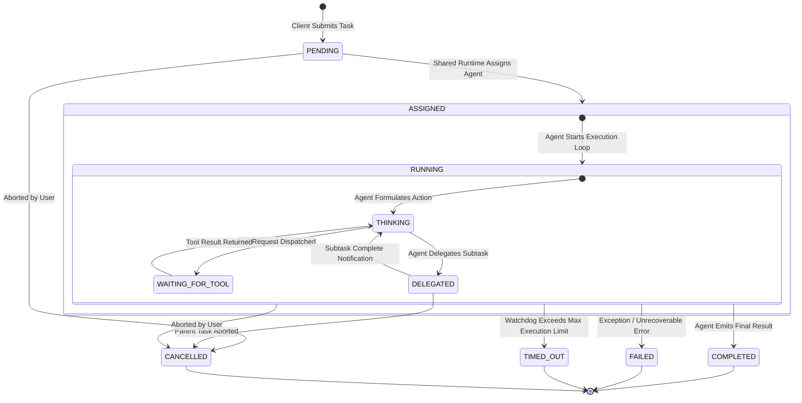

# Architecture Diagram 03 — Task Lifecycle State Machine

### Lifecycle Highlights
- **Parent-Child Linkage:** Delegated tasks maintain `parent_task_id` linkage.
- **Cascading Cancellation:** Aborting a parent task automatically cancels all active delegated child subtasks.
- **Deterministic State Tracking:** State transitions emit async domain events to the Web Dashboard.
