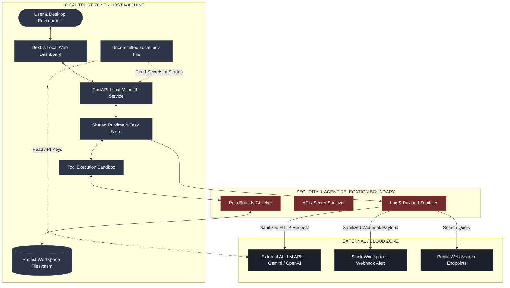

# Architecture Diagram 04 — Local / Cloud Trust Boundaries & Secrets Isolation

### Trust Boundary Safeguards
1. **Local Filesystem Isolation:** File tools cannot access paths outside `workspace_root`.
2. **Secrets Protection:** Keys stay in uncommitted `.env`. No credentials in Git logs or Markdown.
3. **Log Sanitization:** Sensitive tokens scrubbed before broadcasting to UI or Slack.
