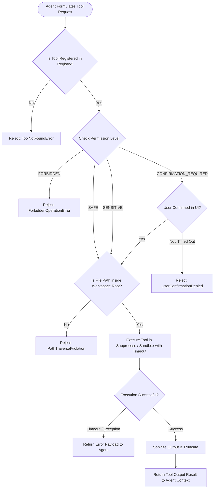

# Architecture Diagram 05 — Tool Permission & Sandboxing Pipeline

### Permission Levels
- **SAFE:** Auto-approved (Read-only).
- **SENSITIVE:** Auto-approved within workspace bounds.
- **CONFIRMATION_REQUIRED:** Suspends execution until user approves via UI.
- **FORBIDDEN:** Blocked outright.
