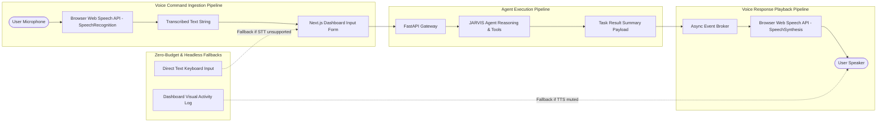

# Architecture Diagram 06 — Voice Pipeline Architecture

### Voice Pipeline Design
1. **Client-Side STT:** Zero-cost speech capture via standard browser APIs.
2. **Asynchronous Agent Execution:** Prompt processes through normal agent pipelines.
3. **Decoupled TTS Playback:** Completion events trigger speech playback without blocking API responses.
