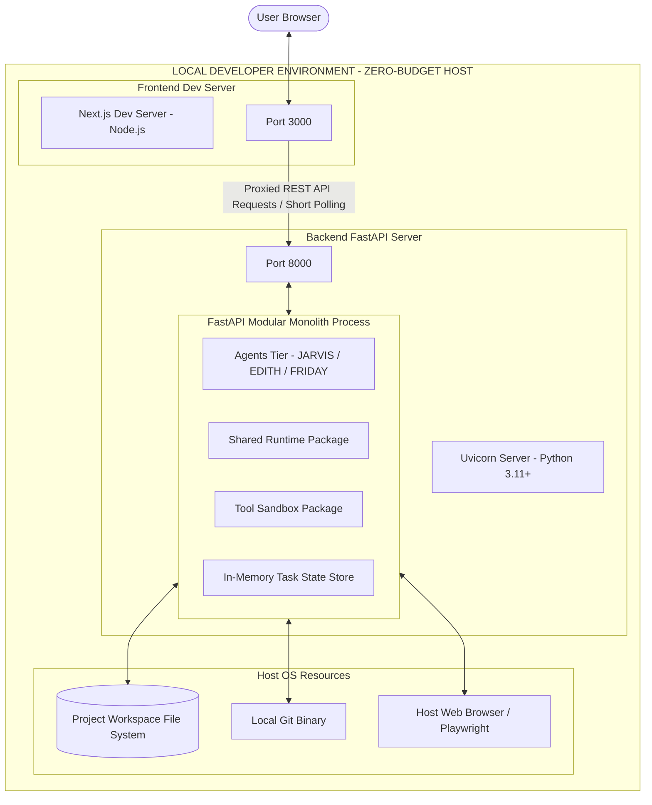

# Architecture Diagram 07 — MVP Deployment & Development Architecture

### Deployment Properties
- **Zero Cost:** No paid cloud servers, databases, or container orchestration services.
- **Single Process Monolith:** Backend components run inside a single Python process managed by `uvicorn`.
- **Development Simplicity:** Live hot-reloading for both Next.js and FastAPI.
