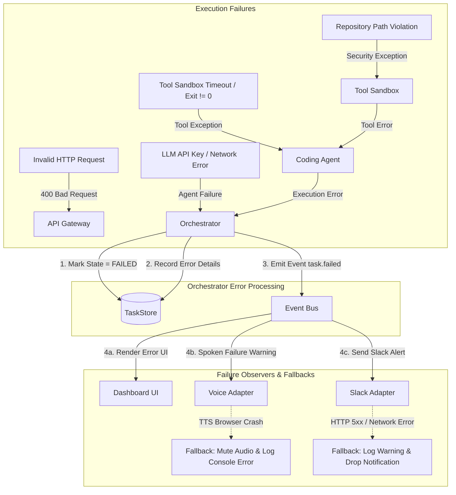

# EDITH-001 — Error & Failure Architecture

**Author:** Mannan Shah (System Designer & Solutions Architect)  
**Project:** EDITH (Enhanced Distributed Intelligent Task Handler)  
**Date:** August 30, 2026  
**Status:** Complete / Proposed Blueprint  

---

## 1. Overview

This document specifies the error handling, failure isolation, and propagation architecture for EDITH. The system is designed to ensure that failures inside non-critical components (e.g., Slack webhook failures or Voice TTS crashes) never crash the core Orchestrator or invalidate task state.

---

## 2. Failure Propagation Architecture



---

## 3. Failure Mode & Recovery Matrix

| Failure Domain | Cause | Detection Mechanism | Recovery / Handling Strategy | User Impact |
| :--- | :--- | :--- | :--- | :--- |
| **API Validation** | Missing prompt string or malformed JSON | FastAPI Pydantic validator | Synchronous HTTP 400 Bad Request return | User sees validation error message in UI |
| **Repository Safety** | Attempt to read/write outside workspace | `ToolSandbox.validate_path()` | Raises `SecurityException`; returns tool error string to Agent | Agent receives security block; task fails gracefully |
| **Tool Execution** | Command non-zero exit code (e.g., test fail) | `subprocess` returncode check | Returns stdout/stderr to Agent for self-correction attempt | Agent attempts bug fix or reports build failure |
| **Execution Timeout** | Tool or agent loop exceeds max limit (e.g., 60s) | `asyncio.wait_for` timeout trigger | Kills subprocess; Orchestrator transitions state to `FAILED` | Task marked `FAILED` with `TimeoutException` |
| **LLM Provider Error**| LLM API rate limit or network connection drop | `HTTPStatusError` / `ConnectionError` | Agent raises `AgentExecutionError`; Orchestrator marks task `FAILED` | UI displays "LLM Provider Unavailable" |
| **Voice STT Failure**| Browser microphone permission denied or unsupported | Web Speech API error handler | Soft fallback to manual text input field | Voice recording disabled; text prompt works standard |
| **Voice TTS Failure**| Browser audio playback blocked by policy | `speechSynthesis.onerror` event | Soft fallback: catch exception, log warning to console | Audio silent; dashboard displays full text summary |
| **Slack Webhook Fail**| Invalid URL, network outage, or Slack HTTP 5xx | Async HTTP client exception | Catch exception, log warning, skip notification | Slack message lost; core task completed successfully |
| **Uncaught Exception**| Unexpected Python runtime error | Global FastAPI exception handler | Catch-all handler returns HTTP 500 JSON payload | UI shows clean system error message |

---

## 4. Error Isolation & Component Boundaries

1. **Orchestrator Isolation:** The Orchestrator wraps all agent dispatch calls in a try-except block. No unhandled exception from an agent or tool can crash the FastAPI background task runner.
2. **Adapter Isolation (Slack / Voice):** Event handlers for Slack webhooks and Voice TTS run as isolated async event callbacks. A network failure in the Slack adapter never bubbles back to the Orchestrator or affects the task's `COMPLETED` state.
3. **Workspace Isolation:** The Tool Execution Layer enforces strict boundary checks (`path.resolve().startswith(workspace_root)`). Path traversal attempts (e.g., `../../etc/passwd`) are rejected instantly.

---

## 5. Proposed Error Payload Structure [PROPOSED]

```json
{
  "task_id": "9b1deb4d-3b7d-4bad-9bdd-2b0d7b3dcb6d",
  "status": "FAILED",
  "error": {
    "code": "TOOL_EXECUTION_TIMEOUT",
    "message": "Tool 'RUN_TEST' exceeded execution limit of 60 seconds",
    "details": {
      "command": "pytest tests/",
      "timeout_seconds": 60
    }
  },
  "failed_at": "2026-08-30T23:10:00Z",
  "_contract_status": "PROPOSED - REQUIRES EDITH-000 APPROVAL"
}
```
