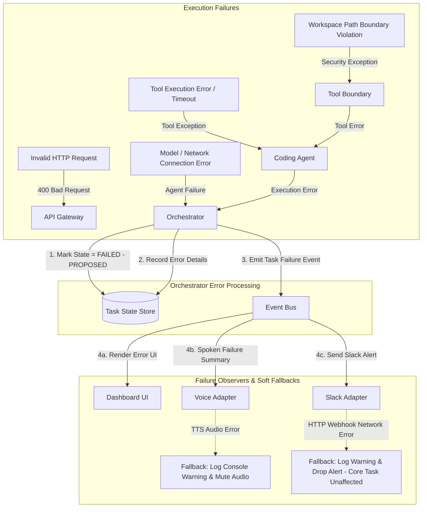

# EDITH-001 — Error & Failure Architecture

**Author:** Mannan Shah (System Designer & Solutions Architect)  
**Project:** EDITH (Enhanced Distributed Intelligent Task Handler)  
**Date:** August 30, 2026  
**Status:** Proposed Specification — Subject to EDITH-000 Approval  

---

## 1. Overview

This document specifies the error handling, failure isolation, and propagation architecture for EDITH. The system is designed to ensure that failures inside optional integration adapters (e.g., Slack webhook network drop or Voice TTS audio crash) **never crash the core Orchestrator or invalidate a successful task execution result**.

---

## 2. Failure Isolation Architecture & Flow



---

## 3. Failure Mode & Recovery Matrix

| Failure Domain | Cause | Detection Mechanism | Recovery / Handling Strategy | Core Task Result |
| :--- | :--- | :--- | :--- | :--- |
| **API Validation** | Missing prompt string or malformed JSON | FastAPI Pydantic validator | Synchronous HTTP 400 Bad Request return | Rejected before task creation |
| **Workspace Boundary**| Attempt to access files outside workspace | Path boundary check | Returns security error string to Agent | Agent receives error; task fails gracefully |
| **Tool Execution** | Command non-zero exit code (e.g., test fail) | `subprocess` returncode check | Returns stdout/stderr to Agent for self-correction attempt | Agent attempts correction or reports build failure |
| **Execution Timeout** | Tool or agent loop exceeds max time limit | Timeout check | Terminates execution; Orchestrator marks state `FAILED` `[PROPOSED]` | Task marked `FAILED` with timeout error |
| **Model Provider Error**| Model API connection drop or rate limit | HTTP error / connection exception | Agent raises execution error; Orchestrator marks state `FAILED` `[PROPOSED]` | Task marked `FAILED` with provider error |
| **Voice STT Failure**| Browser microphone permission denied | Speech API error handler | Soft fallback: disable voice button, use text form | Core task unaffected (input via text) |
| **Voice TTS Failure**| Audio playback blocked by browser policy | Speech synthesis error handler | Soft fallback: catch exception, log warning to console | Core task remains `COMPLETED` (audio silent) |
| **Slack Webhook Fail**| Webhook URL invalid or network outage | Async HTTP client exception | Soft fallback: catch exception, log warning, drop alert | **Core task remains COMPLETED (notification logged separately)** |
| **Uncaught Exception**| Unexpected Python runtime error | Global exception handler | Catch-all handler returns HTTP 500 JSON payload | Server returns 500 error |

---

## 4. Error Isolation Rules

1. **Core Task Independence from Optional Adapters:** If the core task execution succeeds, a subsequent failure in the Slack notification adapter or Voice TTS output adapter **MUST NOT change the task status from COMPLETED to FAILED**. The notification failure is logged separately as a soft adapter warning.
2. **Orchestrator Exception Shielding:** The Orchestrator wraps agent dispatch calls in a try-except block. No unhandled agent or tool exception can crash the background worker thread.
3. **Workspace Security Boundary:** The Tool Execution Boundary enforces strict workspace checks (`path.resolve().startswith(workspace_root)`). Path traversal attempts (e.g., `../../`) are rejected immediately.

---

## 5. Proposed Error Payload Structure [PROPOSED — REQUIRES EDITH-000 APPROVAL]

```json
{
  "task_id": "9b1deb4d-3b7d-4bad-9bdd-2b0d7b3dcb6d",
  "status": "FAILED",
  "error": {
    "code": "TOOL_EXECUTION_TIMEOUT",
    "message": "Tool execution exceeded maximum time limit",
    "details": {
      "command": "pytest tests/",
      "timeout_seconds": 60
    }
  },
  "failed_at": "2026-08-30T23:10:00Z",
  "_contract_status": "PROPOSED — REQUIRES EDITH-000 APPROVAL"
}
```
