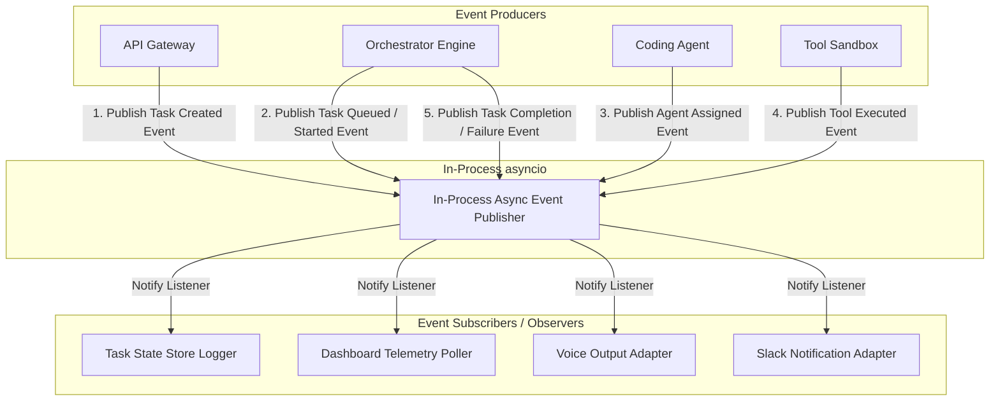

# EDITH-001 — Event Architecture

**Author:** Mannan Shah (System Designer & Solutions Architect)  
**Project:** EDITH (Enhanced Distributed Intelligent Task Handler)  
**Date:** August 30, 2026  
**Status:** Proposed Specification — Subject to EDITH-000 Approval  

---

## 1. Overview

The EDITH event system provides **decoupled in-process publish-subscribe event processing** within the backend process. Components such as the Orchestrator produce domain events when task state transitions occur, allowing external listeners (Slack notification adapter, voice adapter, dashboard logger) to consume events asynchronously without blocking execution.

> **Contract Rule Disclaimer (Rule 8):** All event structures, field names, and topic names in this document are **PROPOSED EVENT NAMES — REQUIRES EDITH-000 APPROVAL** and subject to final contract verification upon approval of **EDITH-000 (Core Specification)**.

---

## 2. Event Publisher-Subscriber Model



---

## 3. Proposed Event Catalog [PROPOSED — REQUIRES EDITH-000 APPROVAL]

| Conceptual Event | Proposed Event Topic | Producer | Primary Payload Concept | Primary Consumers |
| :--- | :--- | :--- | :--- | :--- |
| **Task Created Event** | `task.created` `[PROPOSED]` | API Gateway | `task_id`, `prompt`, `created_at` | Task State Store |
| **Task Queued Event** | `task.queued` `[PROPOSED]` | Orchestrator | `task_id`, `queue_position` | Task State Store, Dashboard |
| **Task Started Event** | `task.started` `[PROPOSED]` | Orchestrator | `task_id`, `started_at` | Task State Store, Dashboard |
| **Agent Assigned Event** | `agent.assigned` `[PROPOSED]`| Orchestrator | `task_id`, `agent_name` | Task State Store, Dashboard |
| **Tool Executed Event** | `tool.executed` `[PROPOSED]` | Tool Layer | `task_id`, `tool_name`, `stdout`, `exit_code` | Dashboard (Terminal Log View) |
| **Task Completion Event**| `task.completed` `[PROPOSED]`| Orchestrator | `task_id`, `summary`, `completed_at` | Dashboard, Voice Adapter, Slack Adapter |
| **Task Failure Event** | `task.failed` `[PROPOSED]` | Orchestrator | `task_id`, `error_message`, `failed_at` | Dashboard, Voice Adapter, Slack Adapter |

---

## 4. Generic Event Payload Structure [PROPOSED — REQUIRES EDITH-000 APPROVAL]

All domain events inherit from a standard base envelope structure to ensure consistent parsing across consumers:

```json
{
  "event_id": "evt_8f3a9b12-4c5d-6e7f-8a9b-0c1d2e3f4a5b",
  "event_type": "task.completed",
  "task_id": "9b1deb4d-3b7d-4bad-9bdd-2b0d7b3dcb6d",
  "timestamp": "2026-08-30T23:05:12.345Z",
  "payload": {
    "status": "COMPLETED",
    "summary": "Modified auth_middleware.py to validate bearer token format. All unit tests passed.",
    "execution_time_seconds": 4.12,
    "tools_used": ["READ_FILE", "WRITE_FILE", "RUN_TEST"]
  },
  "_contract_status": "PROPOSED — REQUIRES EDITH-000 APPROVAL"
}
```

---

## 5. Consumer Integration Details

### 5.1 Dashboard Telemetry
* Reads events stored in the task's execution event log via the HTTP GET API.
* Appends Tool Executed event details to the live log stream UI.

### 5.2 Voice Output Adapter (`packages/voice`)
* Listens specifically for Task Completion and Failure events.
* Extracts summary or error message content.
* Triggers the Text-to-Speech (TTS) adapter (browser-native SpeechSynthesis as a zero-cost MVP option) to summarize task resolution aloud.

### 5.3 Slack Notification Adapter (`packages/slack`)
* Listens for terminal events (Task Completion and Failure events).
* Formats markdown blocks for Slack incoming webhooks.
* Sends HTTP POST requests asynchronously to avoid delaying Orchestrator thread cleanup.
