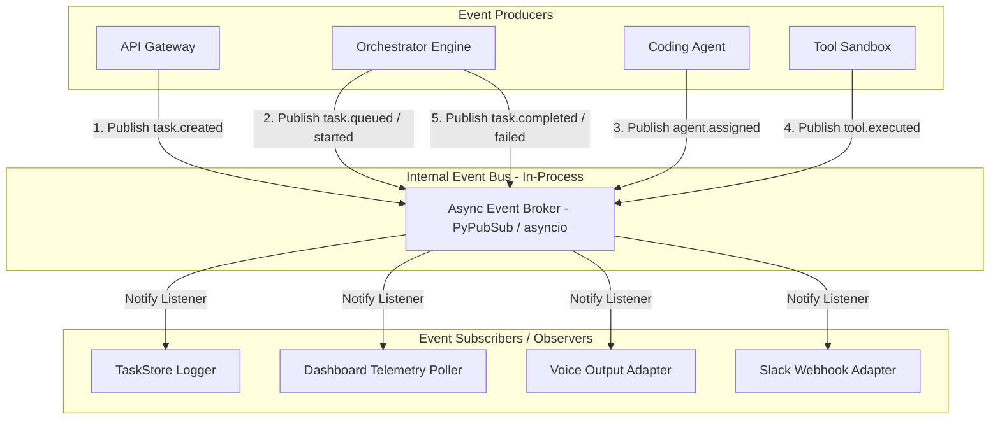

# EDITH-001 — Event Architecture

**Author:** Mannan Shah (System Designer & Solutions Architect)  
**Project:** EDITH (Enhanced Distributed Intelligent Task Handler)  
**Date:** August 30, 2026  
**Status:** Complete / Proposed Blueprint  

---

## 1. Overview

The EDITH event system enables **decoupled publish-subscribe event processing** within the backend process. Components such as the Orchestrator produce domain events when task state transitions occur, allowing external listeners (Slack notification adapter, voice audio synthesizer, dashboard logger) to consume events asynchronously without blocking execution.

> **Contract Rule Disclaimer (Rule 8):** All event structures, field names, and topic names in this document are **PROPOSED** and subject to final contract verification upon approval of **EDITH-000 (Core Specification)**.

---

## 2. Event Publisher-Subscriber Model



---

## 3. Proposed Event Lifecycle & Catalog [PROPOSED]

| Event Topic | Producer | Primary Payload | Primary Consumers |
| :--- | :--- | :--- | :--- |
| `task.created` `[PROPOSED]` | API Gateway | `task_id`, `prompt`, `created_at` | TaskStore |
| `task.queued` `[PROPOSED]` | Orchestrator | `task_id`, `queue_position` | TaskStore, Dashboard |
| `task.started` `[PROPOSED]` | Orchestrator | `task_id`, `started_at` | TaskStore, Dashboard |
| `agent.assigned` `[PROPOSED]`| Orchestrator | `task_id`, `agent_name` | TaskStore, Dashboard |
| `tool.executed` `[PROPOSED]` | Tool Layer | `task_id`, `tool_name`, `stdout`, `exit_code` | Dashboard (Terminal View) |
| `task.completed` `[PROPOSED]`| Orchestrator | `task_id`, `summary`, `completed_at` | Dashboard, Voice Adapter, Slack Adapter |
| `task.failed` `[PROPOSED]` | Orchestrator | `task_id`, `error_message`, `failed_at` | Dashboard, Voice Adapter, Slack Adapter |

---

## 4. Generic Event Payload Structure [PROPOSED]

All domain events inherit from a standard base envelope structure to ensure consistent parsing across consumers:

```json
{
  "event_id": "evt_8f3a9b12-4c5d-6e7f-8a9b-0c1d2e3f4a5b",
  "event_type": "task.completed",
  "task_id": "9b1deb4d-3b7d-4bad-9bdd-2b0d7b3dcb6d",
  "timestamp": "2026-08-30T23:05:12.345Z",
  "payload": {
    "status": "COMPLETED",
    "summary": "Modified auth_middleware.py to validate bearer token format. All 12 unit tests passed.",
    "execution_time_seconds": 4.12,
    "tools_used": ["READ_FILE", "WRITE_FILE", "RUN_TEST"]
  },
  "_contract_status": "PROPOSED - REQUIRES EDITH-000 APPROVAL"
}
```

---

## 5. Consumer Integration Details

### 5.1 Dashboard Telemetry
* Reads events stored in the task's execution event log via the HTTP GET API.
* Appends `tool.executed` lines to the live terminal stream UI.

### 5.2 Voice Output Adapter (`packages/voice`)
* Listens specifically for `task.completed` and `task.failed`.
* Extracts `payload.summary` or `payload.error_message`.
* Triggers client-side browser speech synthesis (`window.speechSynthesis`) to summarize task resolution aloud.

### 5.3 Slack Webhook Adapter (`packages/slack`)
* Listens for terminal events (`task.completed` and `task.failed`).
* Formats markdown blocks for Slack incoming webhooks.
* Sends HTTP POST requests asynchronously to avoid delaying Orchestrator thread cleanup.
