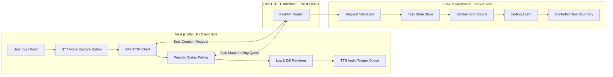

# EDITH-001 — Frontend & Backend Architecture

**Author:** Mannan Shah (System Designer & Solutions Architect)  
**Project:** EDITH (Enhanced Distributed Intelligent Task Handler)  
**Date:** August 30, 2026  
**Status:** Proposed Specification — Subject to EDITH-000 Approval  

---

## 1. Overview

This document specifies the communication contract, responsibilities, CORS security policy, and realtime update strategy between the EDITH Next.js Frontend (`apps/frontend`) and the FastAPI Backend (`apps/backend`).

---

## 2. Division of Responsibilities



### 2.1 Frontend Responsibilities
* **User Input Ingestion:** Provides text area and microphone recording button option for task command entry.
* **Client-Side Speech Ingestion (STT Option):** Uses Speech-to-Text (STT) adapter interfaces (browser-native Web Speech API as a zero-cost MVP implementation option) to transcribe spoken user commands locally.
* **HTTP Communication:** Formats task creation requests and handles asynchronous HTTP responses cleanly using standard HTTP client libraries (`fetch` / `axios`).
* **State & Status Polling:** Executes frontend-controlled periodic HTTP polling with a configurable interval while a task is active (`QUEUED` or `IN_PROGRESS` — *PROPOSED STATES*) to refresh status and progress telemetry.
* **Visual Rendering:** Displays real-time task progress step-by-step, code diffs, terminal execution logs, and completion status badges.
* **Client-Side Speech Output (TTS Option):** Speaks execution summaries upon completion using Text-to-Speech (TTS) adapter interfaces (browser-native SpeechSynthesis as a zero-cost MVP implementation option).

### 2.2 Backend Responsibilities
* **API Entrypoint & Routing:** Exposes RESTful HTTP endpoints for task management. *(Endpoint paths and schemas: PROPOSED — REQUIRES EDITH-000 APPROVAL)*.
* **Request Validation & Security:** Enforces Pydantic payload models and CORS origin checks.
* **Task State Management:** Manages task lifecycle transitions safely inside the in-memory task state store behind a replaceable persistence boundary.
* **Execution & Orchestration:** Orchestrates prompt execution, context retrieval, tool invocation, and error handling.
* **Telemetry & Event Publishing:** Captures execution logs, tool stdout/stderr, and domain events for API query consumption.

---

## 3. Realtime Strategy Decision: HTTP Polling vs. WebSockets

### 3.1 Architectural Comparison

| Dimension | Option A: WebSockets (WS/WSS) | Option B: Configurable Short HTTP Polling (Chosen MVP Strategy) |
| :--- | :--- | :--- |
| **Complexity** | High (Requires connection lifecycle, reconnection, ping/pong, socket state management) | **Very Low** (Standard stateless HTTP requests) |
| **Server Overhead** | High persistent memory footprint per open socket | **Negligible** for single-user/small-team MVP |
| **Browser Compatibility**| Requires fallback logic | **100% Native support** in every environment |
| **Debuggability** | Requires WS framing tools | **Standard Network Tab** in browser dev tools |
| **₹0 Budget Fit** | Requires persistent socket infrastructure | **Ideal** — Zero special server/proxy requirements |

### 3.2 Decision & Justification
**Selected Strategy:** **Frontend-controlled periodic HTTP polling (`PROPOSED: GET /api/v1/tasks/{task_id}`) with a configurable implementation interval.**

For a college SPM project MVP with small-team task executions, periodic HTTP polling provides an identical perceived user experience to WebSockets while eliminating WebSocket connection state management, firewall socket drops, and complex server-side socket routing code.

---

## 4. CORS (Cross-Origin Resource Sharing) Specification

To enable seamless communication during local development (where Next.js frontend and FastAPI backend run on different local ports), the backend must configure FastAPI `CORSMiddleware`.

### 4.1 Development CORS Policy Configuration
```python
# Proposed Backend FastAPI CORS Setup (apps/backend/main.py)
from fastapi.middleware.cors import CORSMiddleware
import os

# Environment-driven allowed origins for development and future environments
allowed_origins = os.getenv(
    "ALLOWED_ORIGINS", 
    "http://localhost:3000,http://127.0.0.1:3000"
).split(",")

app.add_middleware(
    CORSMiddleware,
    allow_origins=allowed_origins,
    allow_credentials=True,
    allow_methods=["GET", "POST", "OPTIONS"],
    allow_headers=["Content-Type", "Authorization"],
)
```

---

## 5. API Endpoints Contract Matrix [PROPOSED — REQUIRES EDITH-000 APPROVAL]

| Method | Proposed Path | Request Payload | Expected Response | Description |
| :--- | :--- | :--- | :--- | :--- |
| **GET** | `/health` | None | `200 OK {"status": "healthy"}` | Server health verification |
| **POST** | `/api/v1/tasks` `[PROPOSED]` | `{"prompt": string}` | `202 Accepted {"task_id": string, "status": string}` | Create & enqueue new task |
| **GET** | `/api/v1/tasks/{task_id}` `[PROPOSED]` | None | `200 OK {"task_id": string, "status": string, "result": object, "logs": array}` | Fetch task status & logs |
| **GET** | `/api/v1/tasks` `[PROPOSED]` | None | `200 OK [{"task_id": string, "status": string}]` | List recent tasks |
