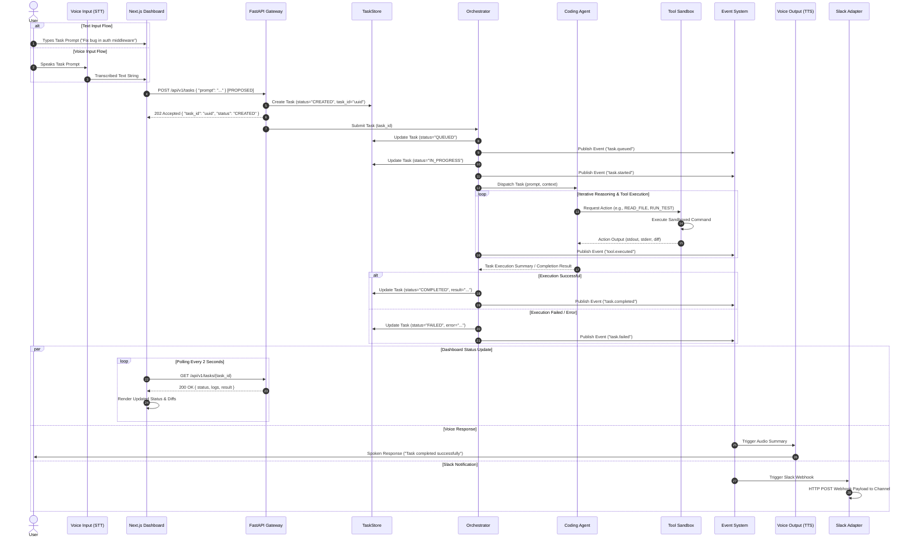

# EDITH-001 — Request & Execution Flow Specification

**Author:** Mannan Shah (System Designer & Solutions Architect)  
**Project:** EDITH (Enhanced Distributed Intelligent Task Handler)  
**Date:** August 30, 2026  
**Status:** Complete / Proposed Blueprint  

---

## 1. Overview

This document defines the complete end-to-end request and execution flow for EDITH, covering every stage from user prompt ingestion to agent execution, dashboard updates, voice playback, and Slack notifications.

> **Contract Rule Disclaimer (Rule 8):** All request/response schemas, API endpoint paths, event names, and task lifecycle states referenced in this document are **PROPOSED** and subject to final contract verification upon approval of **EDITH-000 (Core Specification)**.

---

## 2. End-to-End Execution Sequence Diagram



---

## 3. Step-by-Step Execution Lifecycle Breakdown

### Stage 1: User Command Ingestion
* **Text Mode:** The user enters a natural language task description into the Next.js frontend form.
* **Voice Mode:** The user clicks the microphone button in the UI. The browser Web Speech STT API captures audio input, transcribes it to a clean text string, and populates the text form.

### Stage 2: API Gateway & Task Creation
* The frontend issues an asynchronous HTTP POST request to `POST /api/v1/tasks` `[PROPOSED]`.
* The FastAPI gateway validates the request payload against Pydantic validation schemas.
* A unique `task_id` (UUIDv4) is generated.
* An initial Task record is saved to the in-memory `TaskStore` with status `CREATED`.
* The API immediately returns an HTTP 202 Accepted status code containing `task_id` and initial status to the client, preventing HTTP request timeouts.

### Stage 3: Orchestrator Queue & Initialization
* The API hands over `task_id` to the Orchestrator via an internal async queue (`asyncio.Queue`).
* Orchestrator updates task status to `QUEUED` and emits `task.queued` `[PROPOSED]`.
* Orchestrator inspects the task prompt, selects the target agent (`CodingAgent`), updates task status to `IN_PROGRESS`, and emits `task.started` `[PROPOSED]`.

### Stage 4: Agent Reasoning & Sandboxed Tool Execution
* The `CodingAgent` receives the prompt and builds initial workspace context by requesting tool reads (`READ_FILE`, `INSPECT_DIRECTORY`).
* The `Tool Execution Layer` validates that requested file paths reside inside the permitted workspace sandbox and executes the reads.
* The `CodingAgent` formulates execution steps (e.g., modifying code files, running `pytest`).
* Each tool action output (stdout, stderr, exit code) is captured and recorded.
* Tool execution events (`tool.executed` `[PROPOSED]`) are emitted for log tracking.

### Stage 5: Task Resolution & Lifecycle Termination
* Upon completing all planned sub-steps, the `CodingAgent` returns a structured summary to the Orchestrator.
* If execution succeeded without unhandled errors, Orchestrator marks task status as `COMPLETED` and emits `task.completed` `[PROPOSED]`.
* If an unhandled exception or timeout occurred, Orchestrator marks task status as `FAILED` with error context and emits `task.failed` `[PROPOSED]`.

### Stage 6: Multi-Channel Observer Updates
* **Dashboard:** The Next.js dashboard, executing an active HTTP polling loop (`GET /api/v1/tasks/{task_id}`), fetches the updated state, renders step logs, diffs, and completion badges.
* **Voice Output:** The `packages/voice` module consumes `task.completed` / `task.failed` and triggers browser TTS or local TTS to speak a short response.
* **Slack Notification:** The `packages/slack` module consumes the event, constructs a Slack block payload, and sends an async HTTP POST request to the configured Slack webhook URL.

---

## 4. Contract Schema Placeholders [PROPOSED]

### Proposed Request Schema (`POST /api/v1/tasks`)
```json
{
  "prompt": "Fix import error in user_service.py and run pytest",
  "context": {
    "repository_path": ".",
    "source_channel": "web_ui"
  }
}
```

### Proposed Response Schema (`202 Accepted`)
```json
{
  "task_id": "9b1deb4d-3b7d-4bad-9bdd-2b0d7b3dcb6d",
  "status": "CREATED",
  "created_at": "2026-08-30T23:00:00Z",
  "_contract_status": "PROPOSED - REQUIRES EDITH-000 APPROVAL"
}
```
