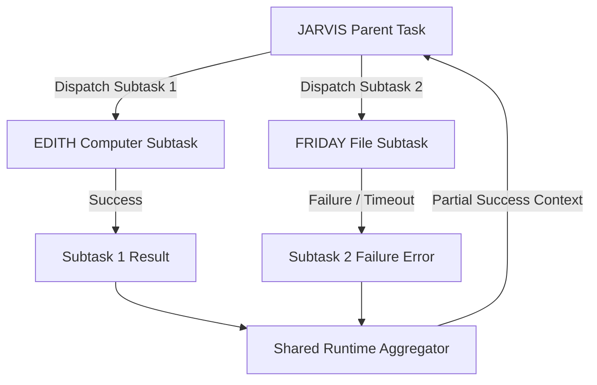

# EDITH-001 — Shared Runtime & Context Architecture

**Author:** Mannan Shah (System Designer & Solutions Architect)  
**Project:** EDITH (Enhanced Distributed Intelligent Task Handler)  
**Date:** September 20, 2026  
**Status:** APPROVED ARCHITECTURE BASELINE  

---

## 1. Shared Runtime vs Agent Boundaries

A critical requirement of the EDITH system architecture is the clean separation of responsibilities between **Specialized Agents** and the **Shared Runtime**:

```
┌─────────────────────────────────────────────────────────────┐
│                      SPECIALIZED AGENTS                     │
│                (JARVIS / EDITH / FRIDAY)                    │
│  • Performs LLM Prompt Formulation & Intent Analysis       │
│  • Decides WHEN delegation is needed                        │
│  • Decides WHICH agent should handle subtasks              │
│  • Formulates edit strategies and tool invocation intent    │
└──────────────┬──────────────────────────────┬───────────────┘
               │ Requests                     │ Responses
               ▼                              ▲
┌─────────────────────────────────────────────────────────────┐
│                       SHARED RUNTIME                        │
│             (Execution & Transport Infrastructure)           │
│  • Agent Registry & Lookup                                  │
│  • Delegation Message Routing & Subtask Creation            │
│  • Task Lifecycle State Management & History Tracking       │
│  • Tool Registry Access & Safety Boundary Enforcement       │
│  • In-Memory Async Event Dispatcher                         │
│  • Context / Memory Repository & Scope Enforcer             │
└─────────────────────────────────────────────────────────────┘
```

> **Crucial Rule:** The Shared Runtime does NOT contain LLM prompts, reasoning heuristics, or central agent selection models. Reasoning is fully owned by the specialized agents.

---

## 2. Shared Context & Memory Model

EDITH manages state and context across multiple scopes:

```
┌─────────────────────────────────────────────────────────────┐
│                   GLOBAL CONTEXT SCOPE                      │
│   • Workspace Root Path, Environment Flags, Active System   │
└──────────────────────────────┬──────────────────────────────┘
                               │ Inherited By
                               ▼
┌─────────────────────────────────────────────────────────────┐
│                    TASK CONTEXT SCOPE                       │
│   • Task ID, Parent Task ID, Source Prompt, Step History    │
└──────────────────────────────┬──────────────────────────────┘
                               │ Inherited By
                               ▼
┌─────────────────────────────────────────────────────────────┐
│                DELEGATED SUBTASK CONTEXT                    │
│   • Parent Context Slice, Subtask Target Intent, Scope Lock │
└─────────────────────────────────────────────────────────────┘
```

### Context Isolation Levels
1. **Task-Scoped Context:** Lives for the duration of a single task request. Discarded when task reaches a terminal state (`COMPLETED` / `FAILED`).
2. **Agent-Scoped Memory:** Stores agent system prompts, available tool schemas, and local operational history.
3. **Parent-Child Context Inheritance:** When JARVIS delegates a subtask to EDITH or FRIDAY, the Shared Runtime passes a read-only context slice containing relevant file paths, user prompt goals, and task constraints.

---

## 3. Concurrency, Parallelism & Failure Aggregation

### 3.1 Subtask Execution
* Subtasks dispatched to EDITH or FRIDAY execute concurrently via `asyncio.create_task()`.
* The parent task (JARVIS) transitions to state `DELEGATED` and awaits child task completion via `asyncio.gather()` with a maximum timeout.

### 3.2 Aggregation & Partial Failure Handling


* If Subtask 1 succeeds and Subtask 2 fails/times out, the Shared Runtime returns a **Partial Execution Result** to JARVIS.
* JARVIS evaluates whether the parent task can still be completed or if a fallback strategy is needed.
* An isolated subtask failure does NOT crash the parent process or corrupt global task state.
