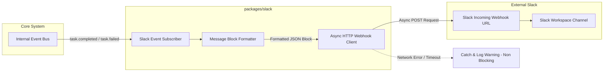

# EDITH-001 — Slack Integration Architecture

**Author:** Mannan Shah (System Designer & Solutions Architect)  
**Project:** EDITH (Enhanced Distributed Intelligent Task Handler)  
**Date:** August 30, 2026  
**Status:** Complete / Proposed Blueprint  

---

## 1. Overview

The Slack Integration Architecture defines how EDITH broadcasts task completion and failure alerts to Slack channels using incoming webhooks. The Slack integration is designed as a **decoupled, fire-and-forget event consumer** (`packages/slack`) operating under strict **₹0 budget constraints**.

---

## 2. Notification Flow Diagram



---

## 3. Trigger Conditions & Notification Layout

Slack notifications are triggered exclusively upon terminal task states to minimize channel spam.

### 3.1 Trigger Events
* **Task Success:** `task.completed` event emitted by Orchestrator.
* **Task Failure:** `task.failed` event emitted by Orchestrator.

### 3.2 Notification Payload Layout Concept

#### Success Notification Block
```json
{
  "text": "✅ EDITH Task Completed: Fix auth middleware",
  "blocks": [
    {
      "type": "header",
      "text": { "type": "plain_text", "text": "✅ Task Completed Successfully" }
    },
    {
      "type": "section",
      "fields": [
        { "type": "mrkdwn", "text": "*Task ID:*\n9b1deb4d" },
        { "type": "mrkdwn", "text": "*Status:*\nCOMPLETED" }
      ]
    },
    {
      "type": "section",
      "text": { "type": "mrkdwn", "text": "*Summary:*\nFixed import bug in user_service.py. All unit tests passed." }
    }
  ]
}
```

#### Failure Notification Block
```json
{
  "text": "❌ EDITH Task Failed: Fix auth middleware",
  "blocks": [
    {
      "type": "header",
      "text": { "type": "plain_text", "text": "❌ Task Execution Failed" }
    },
    {
      "type": "section",
      "fields": [
        { "type": "mrkdwn", "text": "*Task ID:*\n9b1deb4d" },
        { "type": "mrkdwn", "text": "*Status:*\nFAILED" }
      ]
    },
    {
      "type": "section",
      "text": { "type": "mrkdwn", "text": "*Error Details:*\nTool 'RUN_TEST' failed with return code 1." }
    }
  ]
}
```

---

## 4. Credential Isolation & Environment Boundary

To guarantee security and prevent secret leakage:

1. **Environment Configuration:** The Slack webhook URL is injected strictly via environment variable (`SLACK_WEBHOOK_URL`).
2. **Fallback / Disabled State:** If `SLACK_WEBHOOK_URL` is empty, missing, or set to placeholder, the `SlackAdapter` disables itself automatically during startup and logs an informational message (`Slack notifications disabled: SLACK_WEBHOOK_URL not configured`).
3. **No Hardcoded Keys:** Secrets are excluded from source control (`.gitignore` enforces `.env` exclusion).

---

## 5. Failure Isolation & Quality Attributes

* **Non-Blocking Execution:** Slack notifications are dispatched asynchronously (`asyncio.create_task`) outside the main request/response cycle.
* **Fault Tolerance:** HTTP network timeouts, invalid webhook URLs, or Slack API rate limits are caught cleanly by an internal try-except block. Webhook errors log a warning but **never fail the underlying task**.
* **Zero-Budget Compliance:** Uses standard Slack Incoming Webhooks (free feature available in all free Slack workspaces). Requires zero paid bot subscriptions.
