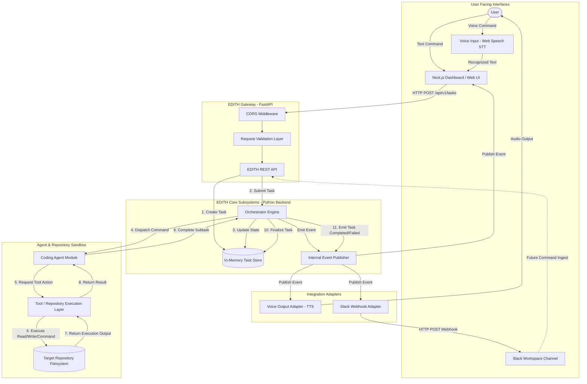

# EDITH-001 — System Architecture Blueprint

**Author:** Mannan Shah (System Designer & Solutions Architect)  
**Project:** EDITH (Enhanced Distributed Intelligent Task Handler)  
**Date:** August 30, 2026  
**Status:** Complete / Proposed Blueprint  

---

## 1. Architectural Overview

EDITH (Enhanced Distributed Intelligent Task Handler) is designed as a **Modular Monolith** for its college MVP release. This architectural pattern balances clean separation of concerns, high maintainability, and rapid development speed with a strict **₹0 operational budget**.

The architecture decouples user interactions (Voice, Web Dashboard, Slack) from core decision-making (Orchestrator) and action execution (Coding Agent & Tool Layer).

---

## 2. High-Level System Architecture Diagram

---

## 3. Boundary & Classification Breakdown

### 3.1 User-Facing Components
* **Next.js Web Dashboard (`apps/frontend`):** Provides task submission interfaces, real-time/polled execution logs, agent state visualizations, and interactive control.
* **Voice Input Interface (`packages/voice`):** Captures spoken audio using client-side browser Web Speech STT API, converts audio to text prompts, and forwards to the API.

### 3.2 Internal EDITH Components (Modular Monolith Backend)
* **EDITH REST API (`apps/backend`):** FastAPI application handling authentication headers, request validation, CORS, and endpoint routing.
* **Task Store (In-Memory):** Thread-safe task state tracking dictionary adhering to the abstract `ITaskRepository` interface.
* **Orchestrator Engine:** Decoupled workflow manager responsible for interpreting task prompts, delegating work to agents, managing retries, and recording state transitions.
* **Internal Event Bus:** Lightweight async event broker (`PyPubSub` or Python `asyncio.Queue`) for decoupled component notifications.
* **Coding Agent Module (`packages/agents/coding`):** Specialized prompt builder and reasoning agent that formulates code edit strategies and tool requests.
* **Tool / Repository Execution Layer:** Low-level filesystem and shell sandbox executing controlled reads, writes, git checks, and command runs.

### 3.3 External Integration Adapters
* **Voice Output Adapter (`packages/voice`):** Transforms task completion summaries into speech via browser Web Speech Synthesis (TTS) or local `gTTS`/`pyttsx3`.
* **Slack Integration Adapter (`packages/slack`):** Event-driven webhook client translating EDITH task completion/failure events into formatted Slack messages.

---

## 4. Control Flow & Communication Strategy

1. **Synchronous Entry:** Task creation is performed synchronously via `POST /api/v1/tasks`. The client receives immediate HTTP 202 Accepted with a unique `task_id`.
2. **Asynchronous Execution:** Orchestrator processes the task asynchronously in a background worker task (`asyncio.create_task`).
3. **Decoupled Event Broadcasting:** State changes emit events (`task.started`, `tool.executed`, `task.completed`). Subscribers (Dashboard Poller, Slack Adapter, Voice Adapter) consume these events independently.
4. **Polling Result Retrieval:** Dashboard polls `GET /api/v1/tasks/{task_id}` every 2 seconds to render state updates without complex WebSocket state overhead.

---

## 5. Architectural Quality Attributes

| Quality Attribute | Architectural Strategy |
| :--- | :--- |
| **Zero-Budget Compliance** | Uses local Python execution, browser Web Speech API, open-source libraries, and free Slack incoming webhooks. Zero required SaaS subscriptions. |
| **Modularity & Isolation** | Codebase is structured as clear python/typescript packages (`packages/*`) and modular backend folders. |
| **Maintainability** | Clean separation between API, Orchestrator, Agent logic, and low-level Tool execution. |
| **Replaceability** | Voice and Slack layers are defined via abstract interface adapters, enabling provider substitution without touching core Orchestrator logic. |
| **Testability** | In-memory task repository and mockable tool interfaces allow 100% offline unit and integration testing. |
