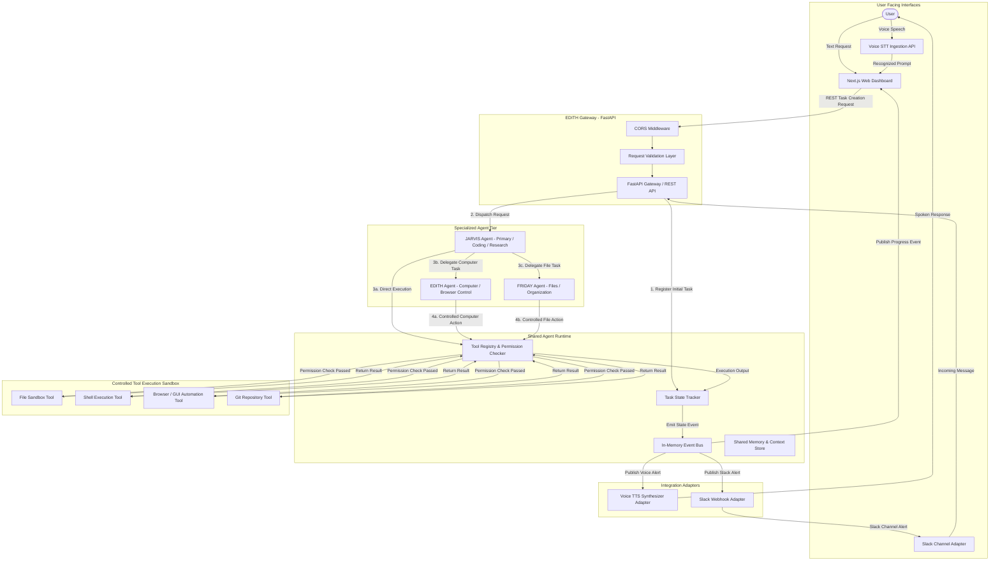

# EDITH-001 — System Architecture Blueprint

**Author:** Mannan Shah (System Designer & Solutions Architect)  
**Project:** EDITH (Enhanced Distributed Intelligent Task Handler)  
**Date:** August 30, 2026 (Updated: September 20, 2026)  
**Status:** APPROVED ARCHITECTURE BASELINE  

---

## 1. Executive Summary & Architectural Vision

EDITH (Enhanced Distributed Intelligent Task Handler) is a multi-agent AI assistant ecosystem built as a **Modular Monolith** for its college MVP release. The architecture balances clean separation of concerns, high maintainability, and rapid development speed under a strict **₹0 operational budget constraint**.

The ecosystem consists of three specialized agents sharing common infrastructure while maintaining distinct domain responsibilities, tool access boundaries, and personalities:
* **JARVIS** — Primary Conversational, Coding, Reasoning, and Research Agent.
* **EDITH** — Computer/Browser Interaction and OS Automation Agent.
* **FRIDAY** — File, Document, and Organization Agent.

```
┌─────────────────────────────────────────────────────────────┐
│                            USER                             │
└──────────────┬──────────────────────────────┬───────────────┘
               │ Spoken Voice Input           │ Audio Response
               ▼                              ▲
┌─────────────────────────────────────────────────────────────┐
│                 VOICE / DASHBOARD FRONTEND                  │
│              (Next.js / Web Speech API MVP)                 │
└──────────────────────────────┬──────────────────────────────┘
                               │ User Request
                               ▼
┌─────────────────────────────────────────────────────────────┐
│                    JARVIS (PRIMARY AGENT)                   │
│        • Conversation • Reasoning • Coding • Research       │
│        • Evaluates and initiates agent delegation           │
└──────────────┬──────────────────────────────┬───────────────┘
               │ Delegated Task               │ Delegated Task
               ▼                              ▼
┌──────────────────────────────┐┌──────────────────────────────┐
│            EDITH             ││            FRIDAY            │
│ (Computer & Browser Specialist)││(Files & Document Specialist)│
└──────────────┬───────────────┘└──────────────┬───────────────┘
               │                              │
               └──────────────┬───────────────┘
                              ▼
┌─────────────────────────────────────────────────────────────┐
│                       SHARED RUNTIME                        │
│   • Execution Coordination        • Routing Infrastructure  │
│   • Task State Tracking           • Event System (asyncio)  │
│   • Tool Registry & Permissions   • Shared Context & Memory │
└──────────────────────────────┬──────────────────────────────┘
                               │ Controlled Tool Requests
                               ▼
┌─────────────────────────────────────────────────────────────┐
│                        TOOL LAYER                           │
│   • Local Filesystem Tool  • Terminal / Shell Exec Tool     │
│   • OS / Browser Control   • Git Repository Tool            │
└─────────────────────────────────────────────────────────────┘
```

The fundamental architectural principle governing EDITH is:
> **Specialized agents make delegation decisions autonomously. The Shared Runtime manages execution coordination, routing infrastructure, task state tracking, tool permissions, and event distribution without acting as a central AI decision-maker.**

---

## 2. End-to-End System Flow



---

## 3. Subsystem Breakdown & Boundary Definitions

### 3.1 Specialized Agent Tier (`apps/backend/agents` / `packages/agents`)
1. **JARVIS (Primary Agent):** Owns conversational interactions, software engineering, reasoning, code synthesis, web research, intent classification, and delegation orchestration.
2. **EDITH (Computer Control Specialist):** Owns desktop GUI automation, browser interaction, active window management, screenshot capture, and local desktop actions.
3. **FRIDAY (Files & Document Specialist):** Owns directory organization, file indexing, document parsing, template generation, bulk file operations, and workspace structuring.

### 3.2 Shared Agent Runtime (`apps/backend/runtime`)
1. **Task Execution Coordinator & Tracker:** Thread-safe state tracker maintaining task lifecycles, parent/child task hierarchies, and delegation graphs.
2. **Message Transport & Event Bus:** In-process asynchronous event broker (`asyncio`) delivering events (`TaskCreated`, `TaskDelegated`, `ToolExecuted`, `TaskCompleted`, `TaskFailed`) to internal listeners.
3. **Shared Context & Memory Store:** Task-scoped and agent-scoped context registry providing memory isolation and parent-child state propagation.
4. **Tool Registry & Permission Enforcer:** Global registry of executable tools enforcing strict safety policies (Safe, Sensitive, Confirmation-Required, Forbidden).

### 3.3 User Interfaces & Integration Adapters (`apps/frontend`, `packages/voice`, `packages/slack`)
1. **Next.js Web Dashboard:** React-based UI providing task submission inputs, configurable HTTP polling for live status, agent activity streams, terminal logs, and system metrics.
2. **Voice Interface:** Abstract STT/TTS adapter layer using browser Web Speech API for zero-cost MVP execution, with fallback mocks for dev/test runs.
3. **Slack Adapter:** Event-driven notification publisher sending task summaries to Slack channels via zero-cost incoming webhooks.

---

## 4. Control, Data, and Trust Boundaries

| Boundary Type | Components Involved | Boundary Enforcer & Mechanics |
| :--- | :--- | :--- |
| **User Boundary** | User ↔ Web UI / Voice Ingestion | REST API Request Validation, CORS Policy, Input Sanitization. |
| **Agent Delegation Boundary** | JARVIS ↔ EDITH / FRIDAY | Shared Runtime Delegation Transport (`parent_task_id`, `source_agent`, `target_agent`). |
| **Tool Execution Boundary** | Agents ↔ Host Environment | Tool Registry Permission Check, Workspace Directory Lock (`path.resolve()`), Execution Timeout Enforcer. |
| **Local / Cloud Boundary** | Shared Runtime ↔ Cloud LLM Services | Provider Abstraction Interfaces (`LLMProvider`). Local credentials kept strictly in local `.env` files (never committed). |

---

## 5. Zero-Budget Architectural Compliance

To ensure EDITH remains 100% operational without mandatory paid subscriptions:
1. **Local Python & FastAPI Backend:** Runs locally on developer/user machines without paid cloud app servers.
2. **Browser-Native Speech Capabilities:** Uses Web Speech API (`SpeechRecognition` & `SpeechSynthesis`) for zero-cost voice ingestion and playback.
3. **Free Tier / Open Source Models:** Supports local models via Ollama / Llama.cpp or free-tier API endpoints (Gemini / OpenAI trial keys) through abstract provider interfaces.
4. **Zero-Cost Storage & Messaging:** Uses in-memory task stores and Python `asyncio` event loops, eliminating required PostgreSQL, Redis, or Kafka infrastructure.
