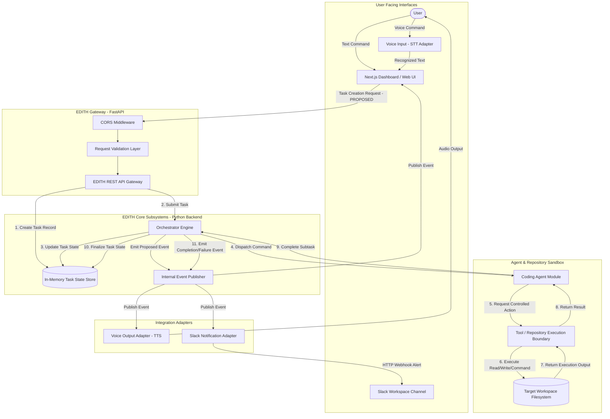

# EDITH-001 — System Architecture Blueprint

**Author:** Mannan Shah (System Designer & Solutions Architect)  
**Project:** EDITH (Enhanced Distributed Intelligent Task Handler)  
**Date:** August 30, 2026  
**Status:** Proposed Blueprint — Subject to EDITH-000 Approval  

---

## 1. Architectural Overview

EDITH (Enhanced Distributed Intelligent Task Handler) is designed as a **Modular Monolith** for its college MVP release. This architectural pattern balances clean separation of concerns, high maintainability, and rapid development speed with a strict **₹0 operational budget**.

The architecture decouples user interactions (Voice, Web Dashboard, Slack) from core decision-making (Orchestrator) and action execution (Coding Agent & Tool Layer).

---

## 2. High-Level System Architecture Diagram

---

## 3. Boundary & Classification Breakdown

### 3.1 User-Facing Components
* **Next.js Web Dashboard (`apps/frontend`):** Provides task submission interfaces, configurable periodic polling for status updates, execution logs, agent state visualizations, and interactive control.
* **Voice Input Interface (`packages/voice`):** Captures spoken audio using provider-independent Speech-to-Text (STT) adapter interfaces (browser-native Web Speech API as a zero-cost MVP implementation option), converts audio to text prompts, and populates the UI.

### 3.2 Internal EDITH Components (Modular Monolith Backend)
* **EDITH REST API Gateway (`apps/backend`):** FastAPI application handling request validation, CORS middleware, and endpoint routing. *(Exact endpoint paths and schemas: PROPOSED — REQUIRES EDITH-000 APPROVAL)*.
* **Task State Store (In-Memory):** Thread-safe task state tracking store operating behind a replaceable persistence boundary.
* **Orchestrator Engine:** Decoupled workflow manager responsible for interpreting task requests, delegating work to agents, managing retries, and recording state transitions.
* **Internal Event System:** Lightweight in-process async event broker (`asyncio`) for decoupled component notifications without external message queues.
* **Coding Agent Module (`packages/agents/coding`):** Specialized decision agent that formulates code edit strategies and tool requests.
* **Tool / Repository Execution Boundary:** Controlled filesystem and command execution boundary performing validated reads, writes, git checks, and command runs with strict path restrictions and timeouts.

### 3.3 External Integration Adapters
* **Voice Output Adapter (`packages/voice`):** Transforms task completion summaries into speech via provider-independent Text-to-Speech (TTS) interfaces (browser-native SpeechSynthesis as a zero-cost MVP implementation option).
* **Slack Integration Adapter (`packages/slack`):** Event-driven notification adapter translating EDITH task completion/failure events into formatted Slack incoming webhook alerts.

---

## 4. Control Flow & Communication Strategy

1. **Synchronous Entry:** Task creation is performed synchronously via a REST task creation request (`PROPOSED: POST /api/v1/tasks`). The client receives an immediate HTTP 202 Accepted response with a unique task identifier.
2. **Asynchronous Execution:** Orchestrator processes the task asynchronously in a background worker task.
3. **Decoupled Event Broadcasting:** State changes emit internal domain events (`Task Created`, `Tool Executed`, `Task Completed` — *PROPOSED EVENT NAMES*). Subscribers (Dashboard, Slack Adapter, Voice Adapter) consume these events independently.
4. **Polling Result Retrieval:** Dashboard performs frontend-controlled periodic polling (`PROPOSED: GET /api/v1/tasks/{task_id}`) to refresh state updates without complex WebSocket state overhead.

---

## 5. Architectural Quality Attributes

| Quality Attribute | Architectural Strategy |
| :--- | :--- |
| **Zero-Budget Compliance** | Uses local Python execution, browser-native speech capabilities as an option, open-source libraries, and free Slack incoming webhooks. Zero required SaaS subscriptions. |
| **Modularity & Isolation** | Codebase is structured as clear packages (`packages/*`) and modular backend folders. |
| **Maintainability** | Clean separation between API, Orchestrator, Agent logic, and controlled Tool execution. |
| **Replaceability** | Voice and Slack layers are defined via abstract provider-independent interfaces, enabling provider substitution without touching core Orchestrator logic. |
| **Testability** | In-memory task state and mockable tool boundaries allow 100% offline unit and integration testing. |
