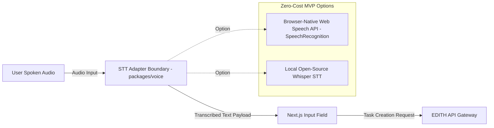
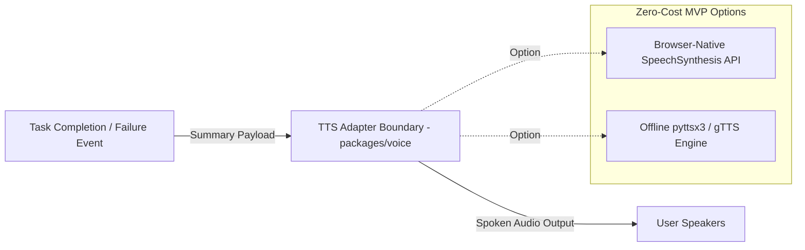

# EDITH-001 — Voice Integration Architecture

**Author:** Mannan Shah (System Designer & Solutions Architect)  
**Project:** EDITH (Enhanced Distributed Intelligent Task Handler)  
**Date:** August 30, 2026 (Updated: September 20, 2026)  
**Status:** APPROVED ARCHITECTURE BASELINE  

---

## 1. Overview

The Voice Integration Architecture defines the provider-independent Speech-to-Text (STT) command ingestion and Text-to-Speech (TTS) response output adapter boundaries for EDITH. In accordance with **Rule 4 (Zero-Budget Constraint)**, the architecture decouples speech capabilities from proprietary paid cloud voice services (e.g., ElevenLabs, Amazon Polly, Google Cloud Speech).

---

## 2. Voice Input & Output Pipeline Concepts

### 2.1 Voice Input Pipeline (Speech-to-Text Boundary)


### 2.2 Voice Output Pipeline (Text-to-Speech Boundary)


---

## 3. Provider-Independent Adapter Interfaces

To prevent vendor lock-in and satisfy zero-budget constraints, the voice subsystem is encapsulated behind provider-agnostic interfaces in `packages/voice`.

### 3.1 Voice Input Adapter Interface (TypeScript Concept)
```typescript
// Proposed Interface (packages/voice/src/types.ts)
export interface IVoiceInputAdapter {
  isSupported(): boolean;
  startListening(onResult: (text: string) => void, onError: (err: string) => void): void;
  stopListening(): void;
}
```

### 3.2 Voice Output Adapter Interface (TypeScript Concept)
```typescript
// Proposed Interface (packages/voice/src/types.ts)
export interface IVoiceOutputAdapter {
  speak(text: string, onEnd?: () => void): void;
  cancel(): void;
}
```

---

## 4. Architectural Boundary vs. Implementation Options

| Component Layer | Architectural Requirement | Possible Zero-Cost MVP Options | Classification |
| :--- | :--- | :--- | :--- |
| **STT (Input)** | Provider-independent Speech-to-Text adapter interface | Browser-native `SpeechRecognition` or local open-source STT | **Zero-Cost MVP Option** |
| **TTS (Output)**| Provider-independent Text-to-Speech adapter interface | Browser-native `SpeechSynthesis` or offline open-source TTS | **Zero-Cost MVP Option** |
| **Cloud Paid Services** | Explicitly excluded from core architecture | None | **Deferred / Not Recommended** |

---

## 5. Architectural Safeguards

1. **Non-Blocking Execution:** Speech synthesis occurs asynchronously after task state resolution. A delay or failure in TTS playback never delays task completion reporting or API responses.
2. **Soft Failure Fallback:** If microphone permission is denied or speech recognition is unsupported by the browser, the UI gracefully disables the voice input button and displays the text input form.
3. **No Mandatory Paid SaaS:** Core EDITH architecture remains 100% functional via standard text prompts without requiring speech services.
