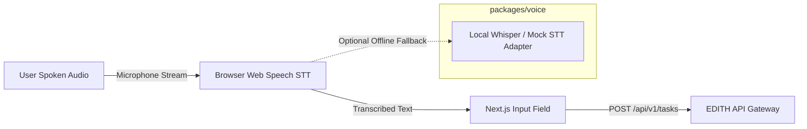
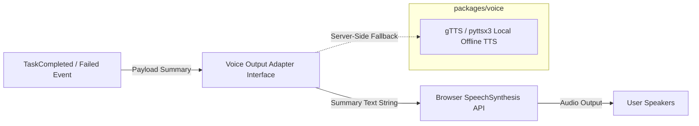

# EDITH-001 — Voice Integration Architecture

**Author:** Mannan Shah (System Designer & Solutions Architect)  
**Project:** EDITH (Enhanced Distributed Intelligent Task Handler)  
**Date:** August 30, 2026  
**Status:** Complete / Proposed Blueprint  

---

## 1. Overview

The Voice Integration Architecture defines the speech-to-text (STT) ingestion and text-to-speech (TTS) output pipelines for EDITH. In accordance with **Rule 4 (Zero-Budget Project)**, the voice architecture relies primarily on **client-side browser-native Web Speech APIs** and free open-source local libraries, completely avoiding paid cloud voice services (e.g., ElevenLabs, Amazon Polly, Google Cloud Speech).

---

## 2. Voice Input & Output Flow Diagrams

### 2.1 Voice Input Pipeline (Speech-to-Text)


### 2.2 Voice Output Pipeline (Text-to-Speech)


---

## 3. Provider Replaceability & Interface Boundary

To prevent vendor lock-in and satisfy zero-budget constraints, the voice subsystem is encapsulated behind clean TypeScript and Python interfaces (`packages/voice`).

### 3.1 Voice Input Adapter Interface (TypeScript)
```typescript
// Proposed Interface (packages/voice/src/types.ts)
export interface IVoiceInputAdapter {
  isSupported(): boolean;
  startListening(onResult: (text: string) => void, onError: (err: string) => void): void;
  stopListening(): void;
}
```

### 3.2 Voice Output Adapter Interface (TypeScript)
```typescript
// Proposed Interface (packages/voice/src/types.ts)
export interface IVoiceOutputAdapter {
  speak(text: string, onEnd?: () => void): void;
  cancel(): void;
}
```

---

## 4. Technology Selection & Zero-Budget Matrix

| Component | Primary Technology | Fallback Technology | Cost | Classification |
| :--- | :--- | :--- | :--- | :--- |
| **STT (Input)** | Browser `webkitSpeechRecognition` / `SpeechRecognition` API | Local `openai-whisper` (CPU/GPU local) or Mock Adapter | **₹0** | **Required for MVP** |
| **TTS (Output)**| Browser `window.speechSynthesis` API | Python `pyttsx3` / `gTTS` (offline open-source) | **₹0** | **Required for MVP** |
| **Cloud STT/TTS**| None | None (Explicitly excluded) | N/A | **Deferred / Not Recommended** |

---

## 5. Architectural Safeguards

1. **Non-Blocking Execution:** Speech synthesis occurs asynchronously after task state resolution. A delay or failure in TTS playback never delays task completion reporting or API responses.
2. **Permission Safety:** If the browser denies microphone access, the UI gracefully disables the voice input button and displays a standard text input field.
3. **Bandwidth Efficiency:** Client-side Web Speech STT converts audio to text directly inside the user's browser, eliminating raw audio upload bandwidth overhead to the backend server.
